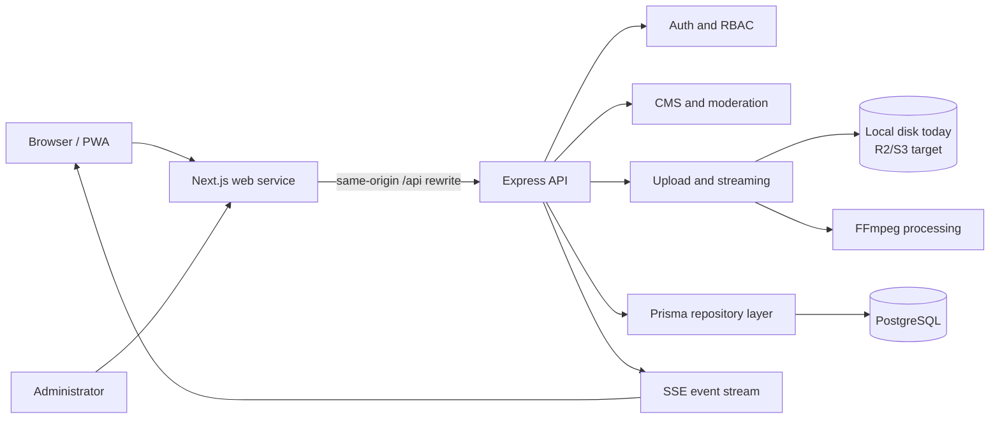
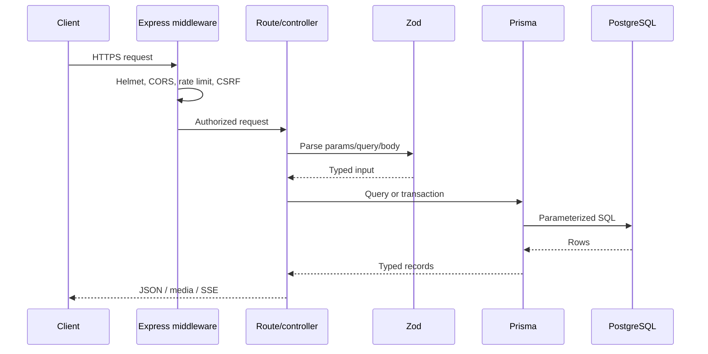
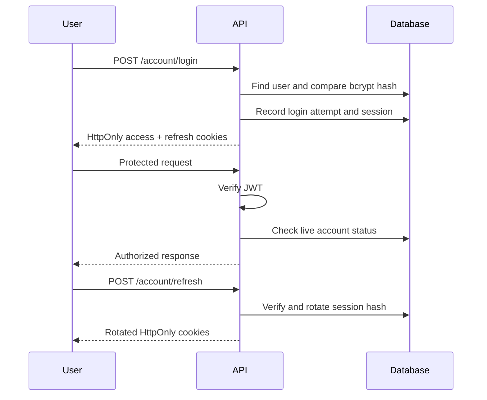
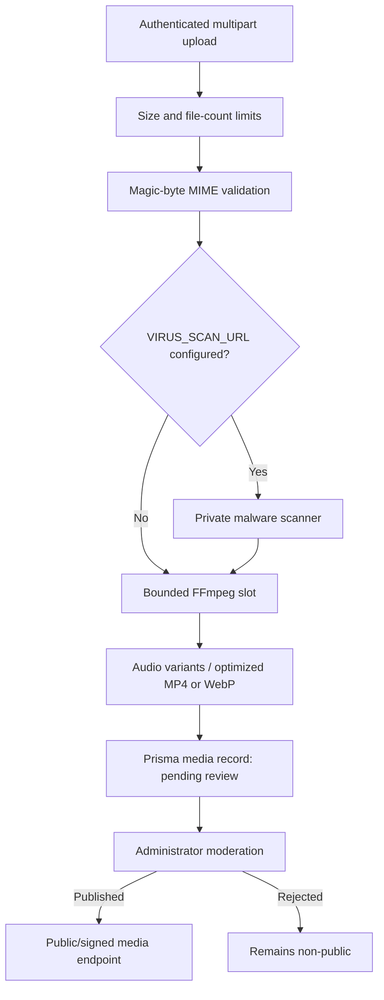
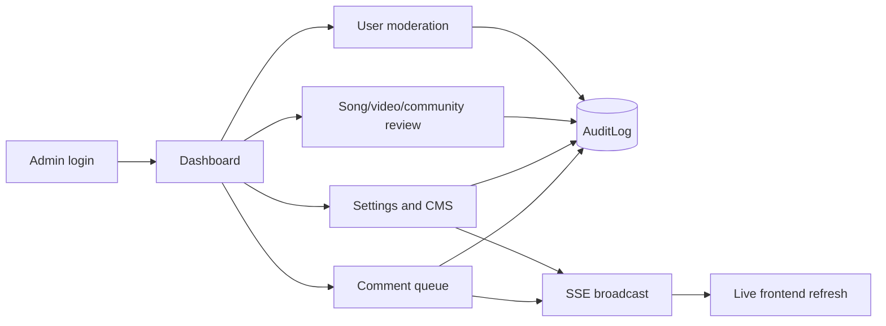
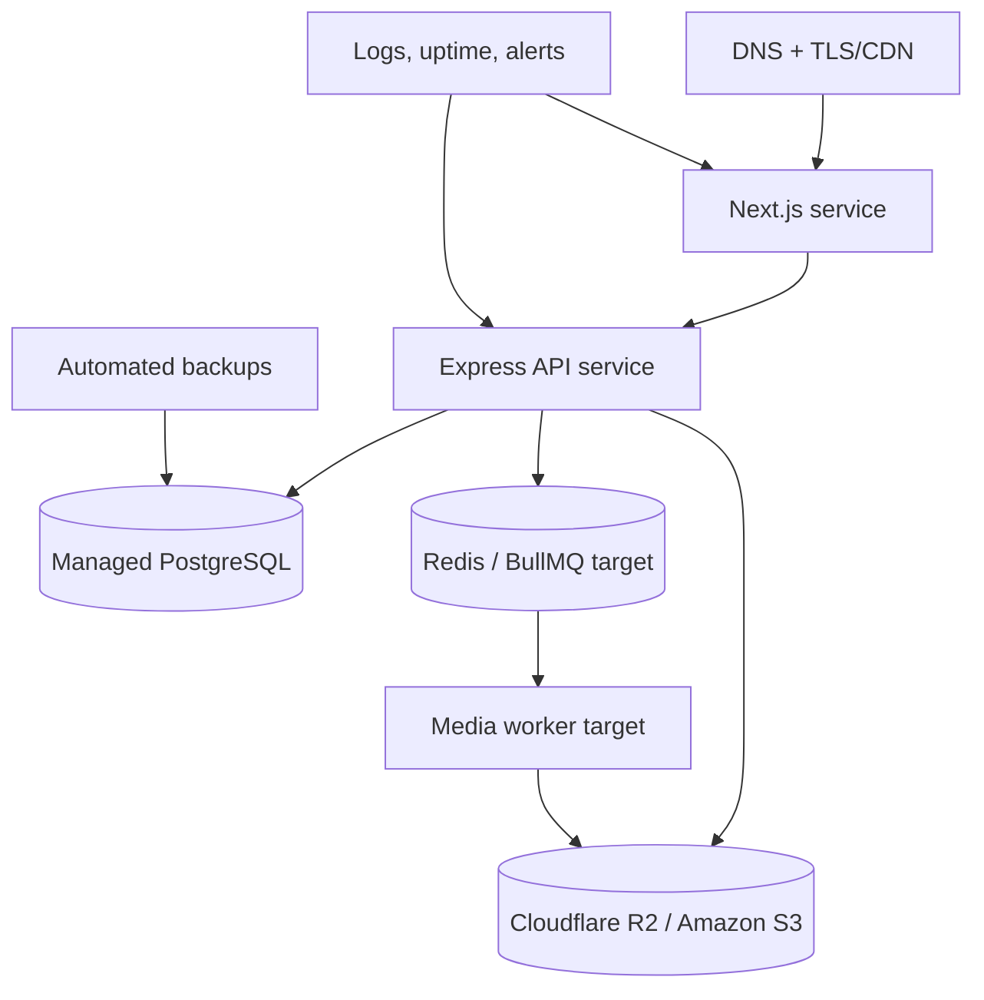

# Tiv Songs Architecture

## System overview

Tiv Songs is a TypeScript monorepo containing a Next.js public/admin application and an Express API. PostgreSQL is the production system of record; SQLite is used only for local development. Prisma owns schema access. Media is validated and processed with FFmpeg before it becomes public.

The current API router remains intact for backward compatibility. New work follows a gradual module-extraction strategy described in `apps/api/src/modules/README.md`.

## Technology stack

| Layer | Technology |
|---|---|
| Web | Next.js 16 App Router, React 19, TypeScript, CSS Modules |
| API | Express 5, TypeScript, Zod |
| Data | Prisma ORM, PostgreSQL 16 production, SQLite local |
| Authentication | JWT access/refresh tokens in HttpOnly cookies, bcrypt |
| Media | Multer, file signature validation, FFmpeg |
| Realtime | Server-Sent Events |
| Security | Helmet, CORS allowlist, CSRF origin checks, rate limiting |
| Testing | Vitest, Supertest, TypeScript |
| Deployment | Render-compatible Node services, managed PostgreSQL, object storage recommended |

## Repository structure

```text
Tivsong website/
├── apps/
│   ├── api/
│   │   ├── prisma/             # schemas, migrations, seed and data normalization
│   │   └── src/
│   │       ├── config/         # validated environment
│   │       ├── database/       # Prisma lifecycle
│   │       ├── docs/           # OpenAPI contract
│   │       ├── middleware/     # centralized error handling
│   │       ├── modules/        # staged feature-module boundaries
│   │       ├── routes/         # backward-compatible API router
│   │       ├── app.ts          # HTTP middleware composition
│   │       └── server.ts       # process lifecycle
│   └── web/
│       ├── app/                # Next.js routes and server/client components
│       └── public/             # static assets and PWA files
├── assets/                     # source heritage assets
├── docker-compose.yml          # local PostgreSQL
└── *.md                        # engineering documentation
```

## Component diagram



## API and database flow



## Authentication flow



Member and artist registration are separate. Only artist registration creates an `Artist` row. Administrators use a separate cookie and `admin`/`super_admin` role claim.

## Upload and streaming flow



Local media works for one API instance. Production scale requires the storage abstraction and an R2/S3 provider; FFmpeg should then run in a queue worker.

## Admin, CMS and moderation workflows



## Deployment architecture



## Security architecture

Trust boundaries exist at the CDN/TLS edge, Next.js rewrite, API middleware, authentication middleware, Prisma, scanner and object storage. State-changing browser requests require a trusted origin. Cookies are HttpOnly, `SameSite=Lax`, secure in production and scoped to `/api`. Passwords use bcrypt; refresh tokens are stored only as SHA-256 hashes. All administrator mutations should create an audit record.

See [SECURITY.md](SECURITY.md) for controls and remaining risks.
