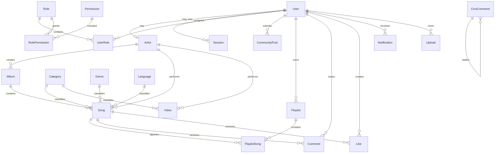

# Tiv Songs Database

The production schema is [apps/api/prisma/schema.prisma](apps/api/prisma/schema.prisma). PostgreSQL is authoritative. `schema.local.prisma` mirrors it for SQLite development. IDs are CUID strings unless a composite key is stated.

## Core ERD

## Identity and access

| Table | Purpose, keys and relationships |
|---|---|
| `User` | PK `id`; unique `email`, `username`; optional one-to-one Artist; owns sessions, roles, social activity, uploads and billing. Indexed by `(status, createdAt)`. `accountType` separates members from artists. Soft deletion uses `status` and `deletedAt`. |
| `Role` | PK `id`; unique `name`; many-to-many users and permissions. |
| `Permission` | PK `id`; unique permission `key`. |
| `UserRole` | Composite PK/FK `(userId, roleId)`; both relations cascade. |
| `RolePermission` | Composite PK/FK `(roleId, permissionId)`; both relations cascade. |
| `Session` | PK `id`; FK `userId` cascades; unique hashed refresh token; indexed `(userId, expiresAt)`. |
| `LoginAttempt` | PK `id`; intentionally denormalized optional `userId`, email, IP, browser/device/country and result. Indexed by email/user/success with date. |
| `UserWarning` | PK `id`; logical `userId`; warning level/reason/issuer and resolution. Indexed `(userId, active, createdAt)`. |
| `AdminNote` | PK `id`; logical `userId`; private note and author. Indexed `(userId, createdAt)`. |

## Music and video catalog

| Table | Purpose, keys and relationships |
|---|---|
| `Artist` | PK `id`; unique FK `userId` cascades; unique `stageName`; owns albums, songs and videos. |
| `Album` | PK `id`; FK `artistId` cascades; indexed `(artistId, releaseDate)`. |
| `Genre` | PK `id`; unique `name` and `slug`; optional Song classification. |
| `Language` | PK `id`; unique `code` and `name`; optional Song classification. |
| `Category` | PK `id`; unique `name` and `slug`; classifies songs/videos. |
| `Song` | PK `id`; unique SEO `slug`; required Artist FK, optional album/genre/language/category FKs; counters stored as BigInt. Indexed by publication and artist/status. |
| `Video` | PK `id`; unique SEO `slug`; required Artist FK and optional Category FK. Indexed `(status, createdAt)`. |
| `Upload` | PK `id`; FK `userId`; provider/storage metadata, verified MIME, size and processing status. Production object-storage key lives here. |
| `MediaAsset` | PK `id`; CMS media library metadata and storage key. Indexed `(folder, kind, createdAt)`. |

## Community and engagement

| Table | Purpose, keys and relationships |
|---|---|
| `CommunityPost` | PK `id`; FK `userId` cascades; event/location/media and moderation status. Indexed by publication date and owner/date. |
| `Playlist` | PK `id`; FK `userId` cascades; public/private playlist. |
| `PlaylistSong` | Composite PK `(playlistId, songId)`; unique `(playlistId, position)`; both FKs cascade. |
| `Like` | Composite PK `(userId, songId)`; prevents duplicate song likes; both FKs cascade. |
| `Comment` | PK `id`; normalized song comment with User/Song FKs; indexed `(songId, createdAt)`. |
| `CmsComment` | PK `id`; polymorphic `targetType/targetId`; logical user ID; self-FK `parentId` cascades; moderation, trust/spam and counters. Indexed by target/status/date and user/date. |
| `History` | PK `id`; User/Song FKs cascade; playback progress. Indexed `(userId, playedAt)`. |
| `Notification` | PK `id`; User FK cascades; typed message/read state/JSON data. Indexed `(userId, readAt, createdAt)`. |
| `ContentReport` | PK `id`; logical reporter and polymorphic target; workflow assignment/resolution. Indexed by status, target and reporter/date. |

## Heritage and editorial

| Table | Purpose, keys and relationships |
|---|---|
| `TorTiv` | PK `id`; unique ordinal; reign dates, portrait, biography and source. |
| `HistoryArticle` | PK `id`; unique slug; localized editorial heritage content and publication date. |
| `CmsEntry` | PK `id`; unique `(kind, slug)`; flexible editorial content, publishing schedule, media, metadata and SEO JSON. Indexed by kind/status/order and publication. |
| `Setting` | String PK `key`; versionless JSON configuration with update timestamp. Runtime validation is enforced with Zod. |
| `EmailTemplate` | PK `id`; unique `key`; subject, HTML/text content and enabled state. |
| `SearchRule` | PK `id`; unique keyword; trending/suggestion/blocked type and weight. Indexed `(type, active, weight)`. |

## Commerce, analytics and accountability

| Table | Purpose, keys and relationships |
|---|---|
| `Payment` | PK `id`; User FK; unique provider reference, integer minor-unit amount, currency/status and JSON metadata. |
| `Subscription` | PK `id`; User FK; plan and validity window. Indexed `(userId, status)`. |
| `AnalyticsEvent` | PK `id`; denormalized event/entity/user/search/source/device data and JSON metadata. Indexed by event/date, entity/date and user/date. |
| `AuditLog` | PK `id`; immutable administrator/system action, actor/role/entity/IP/user-agent/metadata. Indexed by date and actor/date. |

## Enums and constraints

- `UserStatus`: `PENDING`, `ACTIVE`, `SUSPENDED`, `BANNED`, `INACTIVE`, `DELETED`.
- `MediaStatus`: `DRAFT`, `PROCESSING`, `PENDING_REVIEW`, `PUBLISHED`, `REJECTED`, `ARCHIVED`.
- Uniqueness constraints protect identity, SEO slugs, role assignment, playlist order and payment references.
- Referential cascades are used for dependent social/session records. Optional catalog classifications use `SetNull`.
- Monetary values are integer minor units; media counters/sizes use BigInt.

## Normalization assessment

The transactional catalog and identity areas are principally third normal form. `CmsEntry`, `Setting`, event/audit tables and polymorphic comments/reports intentionally use JSON or logical references for CMS flexibility and immutable event capture.

Known trade-offs:

- Logical user IDs in moderation tables preserve audit history but are not database-enforced FKs.
- Polymorphic targets cannot receive native foreign-key enforcement; services must verify targets.
- `Setting.value`, CMS metadata and analytics metadata need versioned Zod schemas as they evolve.
- Artist slugs are derived from unique stage names rather than stored separately.

## Migration and backup rules

Never use `prisma db push` in production. Generate reviewed migrations, test restoration, then run `npm run db:deploy`. Back up PostgreSQL before destructive migrations. The account-normalization task preserves content owners and removes only empty synthetic artist profiles.
