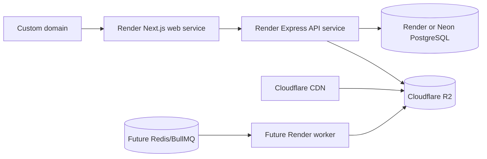

# Tiv Songs Deployment

## Environments

| Environment | Database | Storage | Purpose |
|---|---|---|---|
| Development | SQLite or Docker PostgreSQL | local `uploads/` | Individual development |
| Staging | Separate managed PostgreSQL | separate R2/S3 bucket | Migration and acceptance testing |
| Production | Managed PostgreSQL with backups | private R2/S3 bucket + CDN | Public service |

Never share databases, buckets, JWT secrets or administrator credentials between environments.

## Development

```cmd
npm ci
npm run db:local:setup
npm run dev
```

Web runs on `3000`; API runs on `4000`. If an existing Next process owns port 3000, stop that exact process before restarting.

## Release gate

```cmd
npm run lint
npm test
npm run build
npm audit
```

Back up production, deploy migrations with `npm run db:deploy`, then deploy the API and web services. Probe `/api/health`, sign-in, upload moderation, streaming, admin and rollback behavior.

## Recommended Render topology



API build: `npm ci && npm --workspace @tiv-songs/api run build`

API start: `npm --workspace @tiv-songs/api run start`

API pre-deploy: `npm run db:deploy`

Web build: `npm ci && npm --workspace @tiv-songs/web run build`

Web start: `npm --workspace @tiv-songs/web run start`

Set health check `/api/health` on the API service.

## Vercel option

The Next.js workspace can run on Vercel. Keep the Express/FFmpeg API on a long-running Node service because large streaming uploads and transcoding are not a good serverless fit. Configure `API_URL` during the web build so the same-origin rewrite targets the API.

## Neon PostgreSQL

Use the pooled connection string for application traffic and the direct connection where migrations require it. Enable backups/point-in-time recovery appropriate to the plan. Test migrations against a staging branch first.

## Cloudflare R2 / Amazon S3

Use private buckets, short-lived signed URLs, server-side encryption, lifecycle rules and separate staging/production credentials. Store only object keys in Prisma. Place a CDN in front of public approved media; never make pending uploads public.

## Docker

`docker-compose.yml` provisions local PostgreSQL only. A production image should use a multi-stage Node build, a non-root runtime user, read-only root filesystem, health check and externally managed database/object storage.

## Required environment

See `.env.example`. Production requires:

- `NODE_ENV=production`
- `WEB_URL`, `API_URL`, `NEXT_PUBLIC_API_URL`, `NEXT_PUBLIC_SITE_URL`
- `DATABASE_URL`
- independent JWT secrets
- distinct administrator credentials
- upload limits, scanner and storage credentials

## Backups and rollback

- PostgreSQL: automated snapshots plus tested logical exports.
- Object storage: versioning and lifecycle protection.
- Application: retain previous deploy artifacts/commits.
- Rollback code independently when a migration is backward compatible. For destructive schema changes, use expand/migrate/contract across multiple releases.
