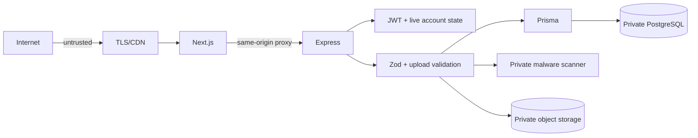

# Tiv Songs Security

## Implemented controls

| Area | Control |
|---|---|
| Transport | Production URLs are required to be HTTPS; TLS terminates at the hosting edge. |
| Headers | Helmet, CSP, frame denial, MIME sniffing prevention, referrer and permissions policies. |
| Cookies | HttpOnly, secure in production, `SameSite=Lax`, `/api` path scoping. |
| Authentication | Short JWT access lifetime, rotating refresh tokens, hashed refresh-token storage, bcrypt passwords. |
| Authorization | Separate account/admin cookies; account state checked on each protected request; super-admin guard for irreversible actions. |
| CSRF | Origin and Fetch Metadata rejection on state-changing browser requests. |
| CORS | Single configured web origin with credentials. |
| Validation | Zod environment, params, query and body validation. |
| SQL injection | Prisma parameterized queries; no raw user-built SQL. |
| XSS | React escapes comment content; CMS HTML remains administrator-controlled and requires sanitization before any future direct rendering. |
| Abuse | Global, login, registration and comment rate limits; trust/spam moderation. |
| Uploads | Count/size limits, magic-byte MIME verification, optional fail-closed malware scanner and bounded processing concurrency. |
| Sessions | Revocation on suspension, ban, deletion, password reset and force logout. |
| Accountability | Administrator changes are written to `AuditLog`; login attempts are recorded. |

## Trust boundaries

## Secrets

Never commit `.env`. Use a deployment secret manager. JWT secrets must be independent random values of at least 32 characters. Administrator and super-administrator passwords must be distinct and rotated after staff changes. Rotate database, SMTP, payment and object-storage keys independently.

## Current risks and required production actions

1. Local media storage supports one API instance only. Use private R2/S3 storage before horizontal scale.
2. FFmpeg currently runs in the API process. Move it to a BullMQ worker before accepting sustained large uploads.
3. Configure `VIRUS_SCAN_URL`; public uploads should fail closed when the scanner is unavailable.
4. Add a database uniqueness constraint for per-user comment reactions/reports if strict race-free deduplication is required.
5. Move administrator identities from environment credentials to database-backed staff accounts with MFA.
6. Add dependency, secret and container scanning to CI.
7. Send JSON logs to an append-only centralized platform; local dated files are not durable on ephemeral hosts.
8. Restrict `/api/docs` in production if the deployment should not publish its contract.

## Incident response

1. Revoke affected sessions and rotate relevant credentials.
2. Preserve audit, authentication, proxy and database logs.
3. Disable compromised features through Website Settings or deployment configuration.
4. Restore from tested database/object-storage backups if integrity is affected.
5. Record timeline, impact, remediation and follow-up controls.

## Reporting

Security reports should include affected URL, reproduction steps, impact and supporting logs without real user secrets. Do not test destructive actions against production data.
